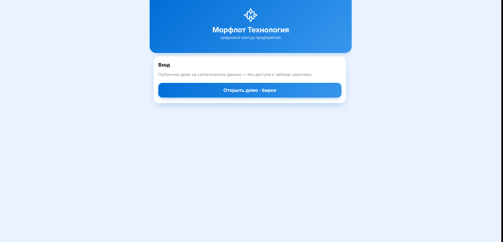
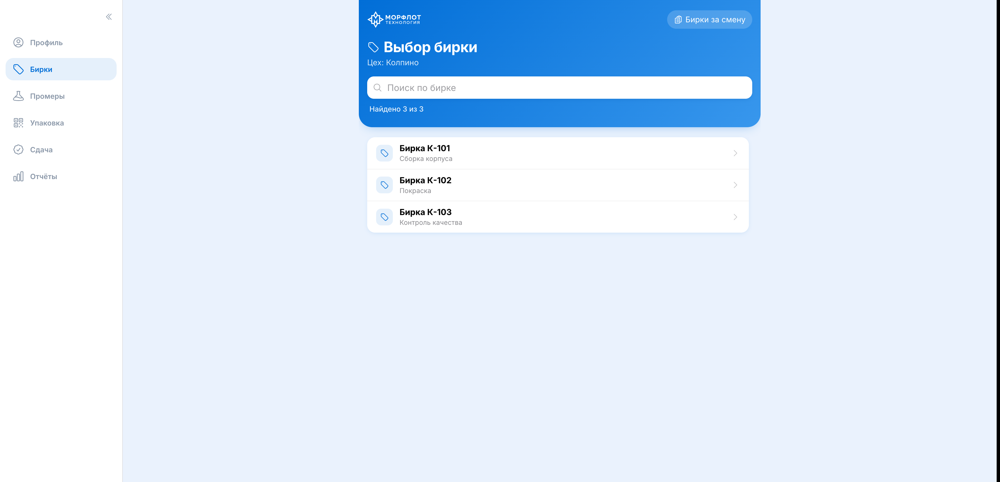
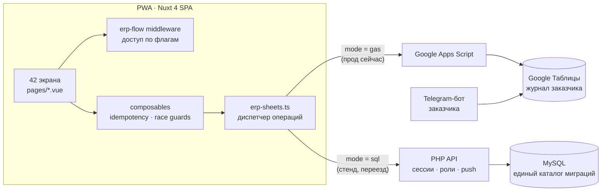
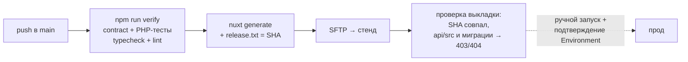

# ERP «Морфлот Технология»

[](https://github.com/egorov-tech/dealio/actions/workflows/nuxtjs.yml)


Внутренняя производственная ERP для промышленного заказчика (антикоррозионная
защита, изоляция, судоремонт). Работает на телефонах мастеров в цеху и на
десктопе в офисе.

**Коротко о проекте:** боевая система в эксплуатации, 42 экрана, 8 модулей,
ролевой доступ. Живая миграция бэкенда с Google Apps Script на PHP + MySQL
без остановки работы. Каждый пуш проходит контрактные тесты, тесты PHP, проверку
типов и линт, а после выкладки CI сверяет, что на сервере именно эта ревизия
и что внутренности API не видны снаружи.

- Прод: <https://erp-mt.ru>
- Стенд: <https://erp-mt.online>
- Публичное демо (мок-данные, без таблицы заказчика): <https://egorov-tech.github.io/dealio/>
- Карта проекта для новых участников: [`docs/ARCHITECTURE.md`](docs/ARCHITECTURE.md)
- **Начать работу над проектом:** [`docs/onboarding/`](docs/onboarding/) — доступы,
  локальный стенд, грабли, стиль
- Инструкция для ИИ-исполнителя (Codex, Cursor, Claude): [`AGENTS.md`](AGENTS.md)


## Скриншоты публичного демо

Синтетические данные, без доступа к таблице заказчика.
Кнопка «Открыть демо · бирки» на [egorov-tech.github.io/dealio](https://egorov-tech.github.io/dealio/).

| Вход | Список бирок |
|---|---|
|  |  |

## Модули

| Раздел | Что делает |
|---|---|
| **Бирки** | Выдача маркировочных бирок цехам, журнал выдачи за смену |
| **Промеры** | Считывание и запись промеров по QR |
| **Упаковка** | QR-скан упаковки с привязкой к площадке и машине |
| **Сдача** | Приёмка выполненных работ, отмена ошибочной сдачи |
| **Склад** | Приём, выдача и остатки по площадкам |
| **Кадры** | Отделы, карточки сотрудников, права доступа, приём и увольнение |
| **Согласования** | Очередь счетов на согласование с уведомлениями |
| **Отчёты** | Сводка по текущей смене |

Доступ к каждому разделу — по флагам сотрудника: таб-бар скрывает недоступное,
а `app/middleware/erp-flow.global.ts` закрывает и прямой переход по URL.

## Стек

Nuxt 4 (SPA, `ssr: false`) · Vue 3 · Pinia · TypeScript · @nuxt/ui.

Бэкенд переезжает с Google Apps Script + Google Таблицы на собственный
PHP API + MySQL (`public/api/`). Оба пути работают одновременно, переключаются
`NUXT_PUBLIC_ERP_BACKEND_MODE` (`gas` | `sql`). Причина переезда и детали —
в [`docs/ARCHITECTURE.md`](docs/ARCHITECTURE.md).

## Архитектура





## Разработка

```bash
npm install
npm run dev

npm run verify      # контрактные тесты + PHP-тесты + типы + линт
npm run generate    # статическая сборка
```

`npm run verify` — то же, что гоняет CI перед сборкой и деплоем. Требует `php`
в PATH: тесты бэкенда входят в проверку.

## Деплой

1. Пуш в `main` — CI собирает и выкладывает на стенд.
2. Ручная проверка стенда.
3. Actions → Run workflow → `production`, с подтверждением в GitHub Environment.

Реквизиты живут только в защищённых окружениях GitHub и в конфиге на сервере
вне webroot. В репозитории секретов нет.

## Инженерные решения

Контекст, который не виден из кода, но объясняет, почему сделано именно так.

### Архитектура и эксплуатация

**Переезд бэкенда без остановки.** Связка «браузер → GAS → Sheets» стала
нестабильной под нагрузкой. Переписать всё разом и переключить за выходные —
значит остановить цеха на время отладки. Вместо этого оба бэкенда работают
параллельно: диспетчер `erp-sheets.ts` выбирает путь для каждой операции, стенд
уже на SQL, прод пока на GAS. Цена — временно большой файл-диспетчер; он
сжимается по мере отключения GAS-путей.

**Выкладка проверяет себя.** «Деплой прошёл» ещё не значит «выложено нужное»:
однажды скрытый `.htaccess` молча терялся по дороге, и сервер работал на старой
копии. Теперь CI пишет SHA коммита в `release.txt`, после выкладки сверяет его
с сайтом и проверяет, что исходники API, `vendor` и миграции отвечают
403/404. Проще было бы ограничиться зелёным шагом `scp`, но он не ловит ни
потерю файла, ни открытую наружу схему базы.

**Один каталог миграций.** Было два, они разъехались, и таблица не создавалась
на чистой базе, хотя код в неё писал. Остался один; миграции применяет фабрика
соединения, а не отдельные разделы. Возврат второго каталога и дыры в нумерации
ловит контрактный тест.

**Контрактные тесты там, где поведение не протестировать дёшево.** Большая часть
JS-тестов читает исходник и проверяет, что нужные вызовы есть, а запрещённых нет.
Это ловит архитектурные регрессии, но не поведение, — поэтому поведенческие
тесты написаны там, где логика чистая (поиск, нормализация).

**Рассылка без публичной ручки.** Уведомление всем сотрудникам отправляет
CLI-скрипт, который CI на один запуск заносит на сервер по SSH и удаляет. HTTP-
эндпоинт «разослать всем» был бы удобнее, но доступен снаружи даже под токеном.

### Продукт и UX

**Не ломать работающий процесс.** У заказчика уже был Telegram-бот выдачи бирок
и таблица на тысячи строк. ERP пишет в те же колонки того же журнала
(`День / Инженер / Бирка / Дата / Цех`) и помечает бирку выданной тем же
способом — иначе бот и веб-приложение конфликтовали бы за одни и те же бирки.

**Подтверждение перед записью.** В списке из 300+ бирок случайный тап по
соседней строке — обычное дело, а цена ошибки — ручная правка в таблице
заказчика. Поэтому выдача идёт через экран подтверждения, а «Это не та бирка»
возвращает назад без последствий.

**Защита от двойной записи.** Ответ GAS иногда теряется на клиенте уже после
того, как сервер записал результат, и слепой повтор задваивал приём или выдачу
на складе. `useIdempotencyKey` выдаёт один `requestId` на конкретный набор
значений формы: повтор после потерянного ответа шлёт тот же ID и
дедуплицируется, а осознанное изменение количества или получателя считается
новой операцией.

**Стражи от гонки ответов.** При быстром переключении категорий на складе
ответы возвращаются вразнобой. `useWarehouseCatalog` записывает результат,
только если выбранная категория не сменилась с момента запроса.

**PWA.** `manifest.json` и иконки из логотипа заказчика: приложение ставится на
экран телефона и открывается сразу в рабочем потоке, без адресной строки.
Статический прелоадер `app/spa-loading-template.html` убирает вспышку пустого
экрана до старта Vue.

**Тактильная отдача.** Короткая вибрация на успехе, двойная на ошибке — мастер
в перчатках не всегда смотрит на экран (Android; в Safari API недоступен).
